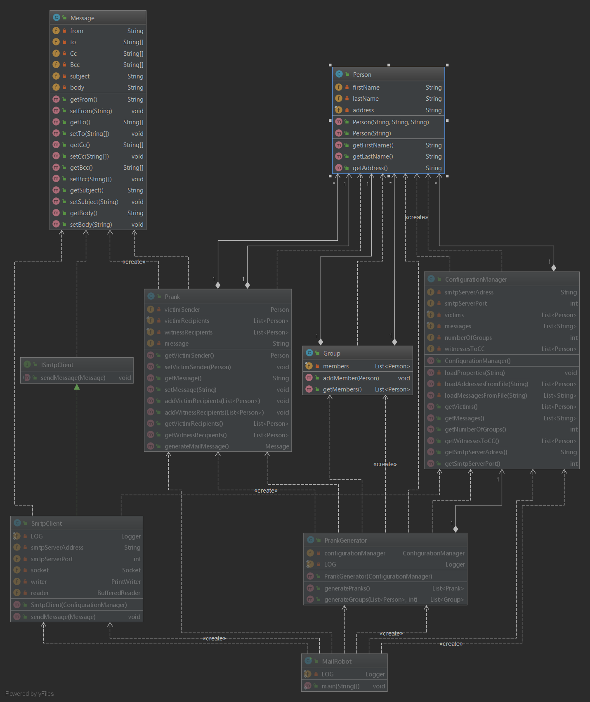

# RES_mail_prank

## Qu'est ce que RES_mail_prank
RES_mail_prank est un générateur de prank par e-mail. Le logiciel permet à partir d'une liste de victimes et de message de générer et envoyer des messages à ces victimes, en leur faisant croire que le message provient d'une des victimes elle-même. Le logiciel permet d'ajouter des témoins en copie de chaques messages envoyé. Ce repo contient toutes les informations nécéssaires au test et à l'installation du logiciel.

## Utilisation d'un serveur Mock SMTP
Afin de tester l'application sans créer de problème, la mise en place d'un serveur Mock SMTP peut s'avérer utile. Un serveur Mock SMTP permet de simuler un serveur SMTP sans que les mails soient réellement envoyé. Cela permet nottament de s'assurer du bon fonctionnement de l'installation et de tester RES_mail_prank.
Nous avons choisi d'utiliser MockMock, un serveur Mock SMTP crée avec Java. L'installation se passe de la manière suivante:
- Cloner le repo : https://github.com/tweakers/MockMock
- Utiliser la commande `mvn clean install` (Nécéssite maven) à la racine du repo.
- Se déplacer dans le dossier target
- Utiliser la commande `java -jar MockMock-1.4.0.one-jar.jar -p <port pour l'accès HTTP> -h <port pour l'accès smtp>`
- L'accès à l'interface de MockMock se fait via un navigateur, en tappant 127.0.0.1:<port pour l'accès HTTP>
Maintenant, tous les messsages envoyer par SMTP au serveur Mock (En précisant le port SMTP) se retrouveront bloqués dans le serveur Mock et pourront être consultés.

## Configuration de l'application
Voici les informations concernant l'installation et l'utilisation du logiciel:
- Cloner ce repo quelque part.
- Utiliser la commande `mvn clean install` (nécéssite maven) à la racine du repo.
- Modifier les fichiers contenus dans le dossier "config". Voici l'utilité des différents fichiers
  - **victims.utf8** : contient les adresses e-mail des victimes à qui vous souhaitez envoyer les mails. Chaque adresse doit tenir sur une nouvelle ligne. Des exemples existent dans le fichier.
  - **messages.utf8** : Contient les messsages que les victimes recevront. Chaque message doit commencer par "Subject: ". pour ajouter un nouveau message, il faut ajouter "==" a la fin du précédent message. Des exemples sont fournis dans le fichier.
  - **config.properties** : Contient les informations de configuration. Le champ *smtpServerAdress* doit être renseigner et contiendra l'adresse du serveur SMTP, tout comme le champ *smtpServerPort* qui contiendra le port du serveur SMTP qui sera utilisé (Le port smtp du serveur Mock par exemple.). Le champ *numberOfGroups* doit aussi être renseigné, et contient le nombre de groupe qui seront crées. Le champ *witnessesToCC* peut être laisser blanc, il contiendra l'adresse mail de la personne qui sera en copie de tous les messages envoyés.
- Se déplacer dans le dossier "target"
- Lancer la commande `java -jar RES_mail_prank-1.0-SNAPSHOT.jar` lancera l'application.

Si vous utiliser un serveur Mock, assurez vous qu'il soit lancer avant toute manipulations. Une fois le logiciel lancé, vous pourrez controller les résultats obtenus sur le serveur Mock.

## Implémentation
UML complète de l'implémentation:

Notre logiciel est séparé en plusieurs parties:
- **Gestion de la configuration**
- **Models**
- **Gestion SMTP**

La gestion de la configuration contient comprend uniquement le fichier "ConfigurationManager" qui permet de récuperer les informations des fichiers de configuration et de les utiliser dans le programme.
La partie model est séparé en deux sous-partie, mail et prank. Mail contient principalement les représentation sous forme d'objet des groupes,des personnes et des messages. Prank contient le fichier "Prank" permettant de représenter un prank complet avec les victimes, le sender, le message en lui même. Prank contient aussi "PrankGenerator" qui permet de générer les Pranks de l'application.
La gestion SMTP contient le fichier "SmtpClient" qui gère la connection et l'envoi des pranks aux diffèrentes personnes.
L'application en elle-même fonctionne de la manière suivante:
- Récupération de la configuration
- Génération des pranks
- Envoi des messsages
- fin de l'application.

## Remarques
- Le fichier RES_mail_prank-1.0-SNAPSHOT.jar peut être lancé depuis d'autres dossier, mais le fichier config doit se trouver un dossier supérieur à lui.

- Le fichier Dockerfile présent sur le repo sert à utiliser un serveur Mock dans un container Docker. Si vous possedez docker et si vous souhaitez créer l'image correspondante, vous pouvez deplacer ce fichier a la racine du repo MockMock et executer la commande "docker build -t <nomDeLimage> ./" dans le même dossier. Vous pourrez lancer le container avec la commande `docker run -p 2525:2525 -p 8080:8080 <nomDeLimage>`. Cela vous permettra d'acceder à l'interface au travers du port 8080 et d'utiliser l'application en précisant le port 2525 dans le fichier config.properties. L'accès à l'interface se fera tout de fois en utilisant l'adresse IP que docker fournit.

- Ce fichier est basé sur l'implémentation proposée par Mr Olivier Liechti dans le cadre du cours RES de la HEIG-VD
